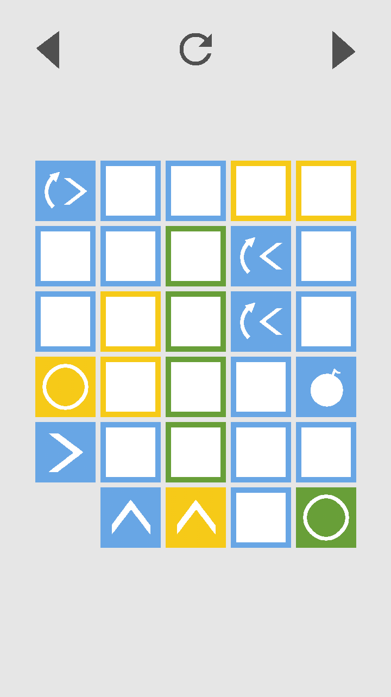

# Flowit


Easy to learn, hard to master. Play the addicting puzzle game Flowit now and to think outside the box.
There are already 75 levels available and even more to come. The game features a clean and elegant design - you will be amazed by the simplicity and complexity at the same time. 
Fill all boxes with the color of their border by using the special boxes. Those, for example, fill surrounding boxes in only one direction with their color. Discover various types of special boxes in the provided level packs.

[](https://f-droid.org/packages/com.bytehamster.flowitgame/)
[](https://play.google.com/store/apps/details?id=com.bytehamster.flowitgame)

## Screenshots

    

## Contributing levels

### Level editor

Levels can easily be created on https://flowit.bytehamster.com using a visual editor.

### Level definitions

Alternatively, levels can be designed in xml.

```
<level number="0"
    color="b0ooo
           b0000
           b0r0g
           b0r0g
           b0r0g
           00000"
    modifier="
           0X00L
           0XXXX
           0XDX0
           0X0X0
           UX0XU
           XXXXX" />
```

| Modifier  | Action |
|--------------|--------|
| 0 | No modifier |
| X | Field disabled |
| F | Flood |
| U | Up |
| R | Right |
| L | Left |
| D | Down |
| B | Bomb |
| w | Up |
| x | Right |
| a | Left |
| s | Down |

### Level packs

- Easy: No need to take away blocks with a modifier that did not create the block
- Hard: I found it hard to solve (even though I designed the level)
- Medium: Everything else
- Community: Contributed levels

## License

This app is licensed under the GPL v3.
